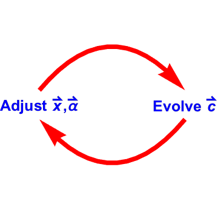

****************************
Diffusive Molecular Dynamics
****************************

Diffusive Molecular Dynamics (DMD) introduced by Li et al. in 2011 :cite:`ju_li_diffusive_2011` offers a new perspective of atomistic simulations, by examinig phase-field theory on an atomistic resolution grid. Li et al. derived the free energy equation for EAM. Later on Simpson and colleagues :cite:`simpson_theoretical_2016` proved rigoursly that as a matter of fact DMD is an proximation of an ensemble they introduced and offered a general formulation of it. It is highly recommended that interested reader examine the abovementioned references. Here we present a very generic formulation of DMD.

Suppose that we have a complicated system with an incalculable partition function :math:`Z`  and potentail energy :math:`U`. On the other hand we have a similar system with a calculable partition function, :math:`\widetilde{Z}` and potential energy :math:`\widetilde{U}`. Gibbs-Bogoliubov and coincidently relative entropy formulation of information theory prove the following inequality:

.. math::
    -\beta^{-1} \log Z \le   \langle U- \widetilde{U} \rangle_{\widetilde{U}} -\beta^{-1} \log \widetilde{Z}

Here :math:`\beta` is :math:`1/k_B T` where :math:`k_B`, and :math:`T` denote Boltzmann factor and the temperature respectively. Now suppose that asside from degrees of freedom (:math:`\mathbf{x}`) our simplified system has extra adjustable parameters (:math:`\mathbf{x}` and  :math:`\mathbf{\alpha}`), above inequality becomes

.. math::
   -\beta^{-1} \log Z \le   \langle U- \widetilde{U}(\mathbf{x},\mathbf{\alpha}) \rangle_{\widetilde{U}(\mathbf{x},\mathbf{\alpha})} -\beta^{-1} \log \widetilde{Z}(\mathbf{x},\mathbf{\alpha})

Naturally, minimizing the right side of the inequality with repect to the adjustable parameters, will get us as close as possible to :math:`-\beta^{-1} \log Z` or otherwise known as free energy (:math:`F`). That is the main idea of DMD approximating a compilicated system with a simplified system with extra parameters.

Let us be more specific, in a general DMD simulation there are :math:`d + 2\times n` degrees of freedom per atom (or more accurately per site), where :math:`d` is the dimension of simulation, and :math:`n` is number of elements present in system. :math:`n` of degrees of freedom represent the propbablity of it being occupuied by each elements (:math:`\mathbf{c}`), :math:`d` of them denote the position of the site (:math:`\mathbf{x}`), and last :math:`n` stiffness of the site associated with each element (:math:`\mathbf{\alpha}`). It is evident that for every site.

.. math:: 0 \leq \sum_{\gamma=0}^{n-1} c_i^\gamma \leq 1,\quad \quad 0 \leq i <N

where :math:`N` is number of sites. Here :math:`\gamma` is merely a label presented in form of a superscript for conveniance. It is worth noting that unlike MD, there is no velocity degrees of freedom.

.. note::

   :math:`\alpha` 's definition in mapp4py and this manual is different from the one Li et al. provided:

   .. math::

      \alpha=\frac{1}{\sqrt{\alpha_{\mathrm{Li\  et\  al.}}}}

   this way :math:`\alpha` like :math:`x` is of unit of length.

As was mentioned before :math:`\mathbf{x}` and :math:`\mathbf{\alpha}` are adjustable parameters and they need to adjusted in order to minimize error of our simplification. However, :math:`\mathbf{c}` is a different story and it should not be adjusted to minimize the free energy. Instead it is evolved using a :ref:`master equation <master-ref>`. The proposed algorithm to perform a dmd simulation is outlined in the figure below:

   DMD algorithm outline

(Re)Adjustment
---------------

This is done by minimizing the relative entropy by means of varying :math:`\mathbf{x}` and :math:`\mathbf{\alpha}`. It is tempting to achieve this byminimizing so called approximate free energy using traditional CG//L-BFGS methods. Although these methods are very effective for VG they are insufficient when it comes to DMD, especifically when we have sites that are vacant or close to being vacant. Suppose that

.. math::
   \widetilde{F}=\langle U- \widetilde{U} \rangle_{\widetilde{U}} -\beta^{-1} \log \widetilde{Z}

working out the derivitives with respect to :math:`\mathbf{x}` and :math:`\mathbf{\alpha}` of a site, namely :math:`i` it can be shown that these dervatives are directely proportional to :math:`c_i`. Therefore when the concentration of site :math:`i` is zero or close to zero these derivatives vanish, leading to intial values of :math:`\mathbf{x}_i` and :math:`\mathbf{\alpha}_i` being unchanged. To remedy the situation instead we solve the following set of nonlinear equations

.. math::
   \frac{1}{c_i}\frac{\partial\widetilde{F}}{\partial \mathbf{x}_i}=0, \quad \frac{1}{c_i}\frac{\partial\widetilde{F}}{\partial \alpha_i}=0, \quad i=0,\cdots N-1

effictively removing the proportionality with respect to :math:`c_i`. These nonlinear equations in MAPP are solved using newton method which in turn employes generalized minimal residual method (GMRES) linear solver. Although this approach seems more costly and elaborate due to calculation of Hessian matrix and inversion of it compared to minimization methods, faster rate convergence and accuracy of the results do compensate for it.

Evolution of Concentration
--------------------------

The master equation by means of which the site concentraions evolve are described in details :ref:`here <master-ref>`. Due to the stiff nature of master equations regular explicit methods such as forward euler are not viable options. Instead in MAPP we use backward differentiation formula algorithm to evaolve the concentration. This numerical method like all other explicit integrators requires solving a set of nonlinear equations at evrey step. However, the fact that timestep is variable and in a sense is adaptive, enables us to perform simulations for a long period. For more details see :py:class:`mapp4py.dmd.bdf`

.. seealso::
   :py:class:`mapp4py.dmd.bdf`
   :py:class:`mapp4py.dmd.min_cg`
   :py:class:`mapp4py.dmd.min_lbfgs`

.. toctree::
   :maxdepth: 2

   master
   integ

.. autosummary::
   :toctree: generated/

   mapp4py.dmd.bdf

References
----------
.. bibliography:: refs.bib
   :filter: docname in docnames
   :style: unsrt
