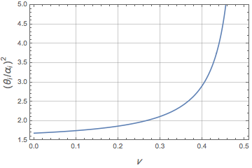

.. _master-ref:

***************
Master Equation
***************

Interpretation of :math:`\alpha`
********************************

Here we try to get a better understanding of :math:`\alpha`. So far it has only been introduced as an adjustable set of parameters of length unit, which helps us with estimation of free energy of a complex system. Let us consider a general three dimensional system close to a local potential energy minimum. If the basin is suffucuently stable we can approximate the potential energy of the system as follows

.. math::
   U(\mathbf{x})\approx U_0 +\frac{1}{2}\left(\mathbf{x}-\mathbf{x}_0\right)^\mathrm{T} \mathbf{J} \left(\mathbf{x}-\mathbf{x}_0\right)

Where :math:`U` is the potntial energy, :math:`\mathbf{x}` and :math:`\mathbf{x}_0` are :math:`3N` dimensional vectors denoting the current atomic positions and positions at minimum, respectively; :math:`\mathbf{J}` is :math:`3N\times3N` symmetric, real Hessian matrix at local minimum. The relative entropy inequality formulation with the adjustable parameters being :math:`\mathbf{X}` (`3N` dimensional vector)  and :math:`\mathbf{A}` (a general :math:`3N\times3N` symmetric, real matrix) will be:

.. math::
   -\beta^{-1} \log Z \le   \langle U- \widetilde{U} \rangle_{\widetilde{U}} -\beta^{-1} \log \widetilde{Z}
   :label: rel-ent-ineq

Where

.. math::
   \widetilde{U}=k_B T  \left(\mathbf{x}-\mathbf{X}\right)^\mathrm{T} \mathbf{A} \left(\mathbf{x}-\mathbf{X}\right)

Now let us calculate :math:`\widetilde{Z}`, :math:`\langle \widetilde{U} \rangle_{\widetilde{U}}`, and :math:`\langle U \rangle_{\widetilde{U}}`. Since :math:`\mathbf{A}` is a general real symmetric matrix, it can be expressed in form of an orthonormal bassis and a diagonal matrix of its eignevalues:

.. math::
   \mathbf{A}=\mathbf{O}^\mathrm{T}\mathbf{\Lambda}\mathbf{O},

Introducing the following change of variables

.. math::
   \mathbf{z}=\mathbf{O}\left(\mathbf{x}-\mathbf{X}\right)\Rightarrow \mathbf{x}-\mathbf{X}=\mathbf{O}^\mathrm{T}\mathbf{z},

:math:`\widetilde{Z}` can be calculated as follows

.. math::
   \widetilde{Z}&=\int d^{3N}\mathbf{x} \exp{ \biggl[ - \left(\mathbf{x}-\mathbf{X}\right)^\mathrm{T} \mathbf{A} \left(\mathbf{x}-\mathbf{X}\right) \biggr]}=\int d^{3N}\mathbf{z} \exp{ \biggl[ -\mathbf{z}^\mathrm{T} \mathbf{\Lambda} \mathbf{z} \biggr]}\\
   &=\frac{\pi^{3N/2}}{\sqrt{\mathrm{det}\left(A\right)}}

Similarley,

.. math::
   \langle \widetilde{U} \rangle_{\widetilde{U}} =&\frac{3N}{2}k_BT

.. math::
   \langle U \rangle_{\widetilde{U}} =&\frac{1}{\widetilde{Z}}\int d^{3N}\mathbf{x} \,U \left(\mathbf{x}\right) \exp{ \biggl[ - \left(\mathbf{x}-\mathbf{X}\right)^\mathrm{T} \mathbf{A} \left(\mathbf{x}-\mathbf{X}\right) \biggr]}\\
   =&U_0+\frac{1}{2}  \left(\mathbf{X}-\mathbf{x}_0\right)^\mathrm{T} \mathbf{J} \left(\mathbf{X}-\mathbf{x}_0\right)\\
   &+\frac{1}{2\widetilde{Z}}\int d^{3N}\mathbf{z} \left(\mathbf{z}^\mathrm{T} \mathbf{O}\mathbf{J} \mathbf{O}^\mathrm{T} \mathbf{z}\right)\exp{ \left( -\mathbf{z}^\mathrm{T} \mathbf{\Lambda} \mathbf{z} \right)}\\
   =&U_0+\frac{1}{2}  \left(\mathbf{X}-\mathbf{x}_0\right)^\mathrm{T} \mathbf{J} \left(\mathbf{X}-\mathbf{x}_0\right)+\frac{1}{4}\mathrm{Tr}\left(\mathbf{J}\mathbf{A}^{-1}\right)

now the right side of the :eq:`rel-ent-ineq` becomes

.. math::
   U_0+\frac{1}{2}  \left(\mathbf{X}-\mathbf{x}_0\right)^\mathrm{T} \mathbf{J} \left(\mathbf{X}-\mathbf{x}_0\right)+\frac{1}{4}\mathrm{Tr}\left(\mathbf{J}\mathbf{B}\right)-\frac{3N}{2}k_BT\left(1+\log\pi \right) - \frac{k_B T}{2}\log|\mathrm{det}\left(\mathbf{B}\right)|

where

.. math:: \mathbf{B}=\mathbf{A}^{-1}

Noting the the change of variable from :math:`\mathbf{A}` to :math:`\mathbf{B}`, the minimization with respect to the adjustable variables, namely :math:`X` and :math:`\mathbf{B}` will lead to

.. math:: \mathbf{X}=\mathbf{x}_0

and

.. math::
   \frac{\partial }{\partial B_{ji}}\left(\mathrm{Tr}\left(\mathbf{J}\mathbf{B}\right)-2k_BT\log[ \det \left(\mathbf{B}\right)]\right)=J_{ij}-2k_B T \underbrace{\frac{\mathrm{adj}\left(B\right)_{ij}}{\det\left(\mathbf{B}\right)}}_{A_{ij}}=0

leading to

.. math::
   A_{ij}=\frac{\beta}{2}J_{ij}

which is not surprising, of course the best estimation of :math:`\mathbf{A}` is proportional to Hessian matrix. For our case of VG\\DMD however, :math:`\mathbf{A}` is constrained via the following fomulation

.. math::
   A=\left[
   \begin{array}{ccccccc}
   \alpha_0^{-2} & 0 & 0 & \cdots & 0 & 0 & 0\\
   0 & \alpha_0^{-2} & 0 & \cdots & 0 & 0 & 0\\
   0 & 0 & \alpha_0^{-2} & \cdots & 0 & 0 & 0\\
   \vdots &\vdots &\vdots &\ddots &\vdots &\vdots &\vdots\\
   0 & 0 & 0 & \cdots & \alpha_{N-1}^{-2} & 0 & 0\\
   0 & 0 & 0 & \cdots & 0 & \alpha_{N-1}^{-2} & 0\\
   0 & 0 & 0 & \cdots & 0 & 0 & \alpha_{N-1}^{-2}
   \end{array}\right]

working out the relative entropy and minimizing we will arrive at:

.. math::
   \boxed{\alpha_i\approx\sqrt{\frac{6 k_B T}{\nabla_{\mathbf{x}_i}^2 U|_{\mathbf{x}=\mathbf{x}_0}}},\quad  \mathbf{X}\approx \mathbf{x}_0}

or

.. math:: \sum_{j=0}^{2} J_{3i+j,3i+j}=6\frac{k_B T}{\alpha_i^2}

Asymptotic Relationship Between RMS and :math:`\alpha`
******************************************************

It can be showed that covariance is directley related to inverse of Hessian matrix

.. math::
   \langle x_{i}x_{j}\rangle-\langle x_{i}\rangle \langle x_{j}\rangle =  k_B T {J^{-1}}_{ij}
   :label: hes-cov

where :math:`{J^{-1}}` denotes the inverse of Hessian matrix. However, due to translational symmetry Hessian matrix is not invertible. Here by inverse of Hessian matrix we mean:

.. math:: \mathbf{J}^{-1}=\sum_{\lambda_i\neq 0} \frac{1}{\lambda_i} \mathbf{o}_i\otimes\mathbf{o}_i

where  the set of :math:`\lambda_i` s and :math:`\mathbf{o}_i` s are the eigenvalues and orthonormal vectors associated with :math:`\mathbf{J}`.

For conveniance let us divide the :math:`3N\times 3N` to :math:`N^2` :math:`3\times 3` matrices

.. math::
   \widetilde{\mathbf{J}}_{ij}=\left[
   \begin{array}{ccc}
   J_{3i,3j} & J_{3i,3j+1} & J_{3i,3j+2}\\
   J_{3i+1,3j} & J_{3i+1,3j+1} & J_{3i+1,3j+2}\\
   J_{3i+2,3j} & J_{3i+2,3j+1} & J_{3i+2,3j+2}
   \end{array}\right]

Using :eq:`hes-cov` mean square displacement of an atom//site :math:`i` can be calculated via

.. math:: \langle \mathbf{x}_{i}.\mathbf{x}_{i}\rangle-\langle \mathbf{x}_{i}\rangle.\langle \mathbf{x}_{i}\rangle =k_B T \mathrm{Tr}\left[\widetilde{\mathbf{J}}^{-1}_{ii} \right]

where :math:`\mathbf{x}_{i}` is a three dimensional vector denoting the position of atom :math:`i`. On the other hand

.. math:: \mathrm{Tr}\left[\widetilde{\mathbf{J}}_{ii} \right]=\frac{6 k_B T}{\alpha_i^2}

In accordance with :math:`\alpha_i` let us introduce a new vaiable which is also of unit of length:

.. math:: \theta_i=\sqrt{\frac{2}{3}\left(\langle \mathbf{x}_{i}.\mathbf{x}_{i}\rangle-\langle \mathbf{x}_{i}\rangle.\langle \mathbf{x}_{i}\rangle\right)}

we are intrested in finding the ratio :math:`\theta_i/\alpha_i`

.. math:: \left(\frac{\theta_i}{\alpha_i}\right)^2=\frac{1}{9}\mathrm{Tr}\left[\widetilde{\mathbf{J}}^{-1}_{ii} \right] \mathrm{Tr}\left[\widetilde{\mathbf{J}}_{ii} \right]

in order to calculate this value we need to have some insight into form of :math:`\widetilde{\mathbf{J}}_{ii}`. From here on we will simplify the problem significantly. Suppose that we are dealing with an isotropic infinite crystal defined by a three dimensional bravis lattice. We label every atom by a triplet integer vector, refering to the corresponding primitive unit cell containing that atom. Due to the periodic nature of the problem and translational symmetry the Hessian submatrices can be expressed using discrete Fourier transform:

.. math::
   \widetilde{\mathbf{J}}_{\mathbf{m}\mathbf{n}}=\frac{1}{\sqrt{N}}\sum_{\mathbf{k}}\widetilde{\mathbf{J}}\left(\mathbf{k}\right) e^{\frac{2\pi i}{N} (\mathbf{m}-\mathbf{n}).\mathbf{k}}

where :math:`N` is the total number of atoms, as :math:`N` tends to infinity we can redefine the fourier transform

.. math::
   \widetilde{\mathbf{J}}\left(\mathbf{x}_i,\mathbf{x}_j \right)=\left(\frac{a}{2\pi}\right)^3 \int_{\mathrm{BZ}} d^3q \widetilde{\mathbf{J}}\left(\mathbf{q}\right) e^{2\pi i(\mathbf{x}_i-\mathbf{x}_j).\mathbf{q}}

where :math:`\widetilde{\mathbf{J}}\left(\mathbf{q}\right)` is a :math:`3\times 3` matrix periodic in reciprocal space defined over reciprocal unit cell (Brillouin Zone). We can get some insight into form of :math:`\widetilde{\mathbf{J}}\left(\mathbf{q}\right)` using theory of elasticity. For an isotropic material

.. math::
   \widetilde{\mathbf{J}}\left(\mathbf{q}\right)\approx \mu q^2 \left(\mathbf{I}+ \frac{1}{1-2\nu}\hat{\mathbf{q}}\otimes \hat{\mathbf{q}}\right)

where :math:`\hat{\mathbf{q}}` is the normalize form of :math:`\mathbf{q}`; :math:`\mu` and :math:`\nu` denote shear modulus and poisson ratio, respectively. It is easy to see

.. math::
   \widetilde{\mathbf{J}}^{-1}\left(\mathbf{q}\right)\approx \frac{1}{\mu q^2} \left(\mathbf{I}- \frac{1}{2\left(1-\nu\right)}\hat{\mathbf{q}}\otimes \hat{\mathbf{q}}\right)

arrving at

.. math::
   \frac{1}{3}\mathrm{Tr}\left[\widetilde{\mathbf{J}}\left(\mathbf{q}\right)\right] &\approx \mu q^2\left(1+\frac{1}{3\left(1-2\nu\right)}\right),\\
   \frac{1}{3}\mathrm{Tr}\left[\widetilde{\mathbf{J}}^{-1}\left(\mathbf{q}\right)\right] &\approx\frac{1}{\mu q^2}\left(1-\frac{1}{6\left(1-\nu\right)}\right)

This gives us an asymptotic form. Howver it is important to recall the like :math:`\mathbf{J}\left( \mathbf{q}\right)`, its trace must be periodic over Brillouin Zone. Therefore it can be expressed in form of a Fourier series

.. math::
   \frac{1}{3}\mathrm{Tr}\left[\widetilde{\mathbf{J}}\left(\mathbf{q}\right)\right]=\sum_{i=0}^{\infty} \sum_{j=0}^{\infty} \sum_{k=0}^{\infty}  A_{ijk}\cos\left( i a q_0\right)\cos\left( j a q_1\right)\cos\left( k a q_2\right)

provided that

.. math:: A_{000}=-\sum_{i=1}^{\infty} \sum_{j=1}^{\infty} \sum_{k=1}^{\infty}  A_{ijk}

Considering the first four terms of the series

.. math:: \frac{1}{3}\mathrm{Tr}\left[\widetilde{\mathbf{J}}\left(\mathbf{q}\right)\right] &\approx \frac{\mu}{a^2} \left(1+\frac{1}{3\left(1-2\nu\right)}\right) \left(1-\frac{\cos a q_x +\cos a q_y +\cos a q_z}{3}\right)

.. math:: \frac{1}{3}\mathrm{Tr}\left[\widetilde{\mathbf{J}}^{-1}\left(\mathbf{q}\right)\right] &\approx \frac{a^2}{\mu} \left(1-\frac{1}{6\left(1-\nu\right)}\right) \left(1-\frac{\cos a q_x +\cos a q_y +\cos a q_z}{3}\right)^{-1}

Noting that

.. math::
   &\left(\frac{a}{2\pi}\right)^3\int_{\mathrm{BZ}} d^3 q\left(1-\frac{\cos a q_x +\cos a q_y +\cos a q_z}{3}\right)=1,\\
   &\left(\frac{a}{2\pi}\right)^3\int_{\mathrm{BZ}} d^3 q\left(1-\frac{\cos a q_x +\cos a q_y +\cos a q_z}{3}\right)^{-1}\approx 1.516386

we finally arrive at

.. math::
   \boxed{\left(\frac{\theta_i}{\alpha_i}\right)^2 =\frac{1}{9}\mathrm{Tr}\left[\widetilde{\mathbf{J}}\left(\mathbf{x}_i,\mathbf{x}_i \right)\right]\mathrm{Tr}\left[\widetilde{\mathbf{J}}^{-1}\left(\mathbf{x}_i,\mathbf{x}_i \right)\right]\approx \left(1+\frac{1}{3\left(1-2\nu\right)}\right) \left(1-\frac{1}{6\left(1-\nu\right)}\right) 1.516386}

   :math:`\left(\theta_i/\alpha_i\right)^2` versus poisson ratio

For a typical case of :math:`\nu=0.3`

.. math:: \boxed{\left(\frac{\theta_i}{\alpha_i}\right)^2 \approx 2.118, \quad \sqrt{\langle \mathbf{x}_{i}.\mathbf{x}_{i}\rangle-\langle \mathbf{x}_{i}\rangle.\langle \mathbf{x}_{i}\rangle} \approx \alpha_i \sqrt{3.178}}

Estimation of Saddle Point
**************************

Suppose we have an atomic site positioned at :math:`\mathbf{x}_i`, one can estimate the effective 1 particle density as follows

.. math:: p_i\left(\mathbf{x}\right) \propto \exp \left(-\beta u_i - \left(\frac{\mathbf{x}-\mathbf{x}_i}{\theta_i}\right)^2 \right),

where, :math:`f_i` is the mean potential energy exerted on the atom :math:`i` and :math:`\theta_i` is

.. math:: \theta_i=\sqrt{\frac{2}{3}\left(\langle \mathbf{x}_{i}.\mathbf{x}_{i}\rangle-\langle \mathbf{x}_{i}\rangle.\langle \mathbf{x}_{i}\rangle\right)}

in other words in the proximity of :math:`\mathbf{x}_i`

.. math:: {U^{eff}}_{i} \left(\mathbf{x}\right)\approx u_i +k_B T \left(\frac{\mathbf{x}-\mathbf{x}_i}{\theta_i}\right)^2.

Similarly for a neighboring atom :math:`j`

.. math:: {U^{eff}}_{j} \left(\mathbf{x}\right)\approx u_j +k_B T \left(\frac{\mathbf{x}-\mathbf{x}_j}{\theta_j}\right)^2.

Here we try to construct a more general potential energy which encompasses both sites. Such potential must satisfy the following  26 conditions!

.. math:: U^{eff}_{ij}\left(\mathbf{x}_i\right)=u_i \quad U^{eff}_{ij}\left(\mathbf{x}_j\right)=u_j,

.. math:: \nabla U^{eff}_{ij}|_{\mathbf{x}=\mathbf{x}_i}=0, \quad \nabla U^{eff}_{ij}|_{\mathbf{x}=\mathbf{x}_j}=0,

.. math:: \nabla\nabla U^{eff}_{ij}|_{\mathbf{x}=\mathbf{x}_i}=\frac{2k_B T}{\theta_i^2} \mathbf{I}, \quad \nabla\nabla U^{eff}_{ij}|_{\mathbf{x}=\mathbf{x}_j}=\frac{2k_B T}{\theta_j^2} \mathbf{I}

where :math:`\mathbf{I}` is :math:`3\times 3` identity tensor. In order to simplify the problem we position site :math:`i` at origin and site :math:`j` on :math:`z` axis. Using cylendrical coordinates :math:`\left(r,\theta,z \right)` and noting the axisymmetric nature of the problem and therefore dropping the dependency of function on :math:`\theta`

.. math:: U^{eff}_{ij}(0,0) = u_i, \quad U^{eff}_{ij}(0,x_{ij}) = u_j

.. math:: \nabla U^{eff}_{ij}(0,0) = 0, \quad \nabla U^{eff}_{ij}(0,x_{ij}) = 0

.. math:: \nabla \nabla U^{eff}_{ij}(0,0) = \frac{2 k_B T}{\theta_i^2} \left( \mathbf{e}_r \otimes\mathbf{e}_r + \mathbf{e}_\theta \otimes\mathbf{e}_\theta + \mathbf{e}_z \otimes\mathbf{e}_z\right)

.. math:: \nabla \nabla U^{eff}_{ij}(0,x_{ij}) = \frac{2 k_B T}{\theta_j^2} \left( \mathbf{e}_r \otimes\mathbf{e}_r + \mathbf{e}_\theta \otimes\mathbf{e}_\theta + \mathbf{e}_z \otimes\mathbf{e}_z\right)

Where :math:`x_{ij}` denotes the seperation between site :math:`i` and :math:`j`. Now we try to write the lowest order polynomial of :math:`r` and :math:`z`, that satisfies boundary conditions

.. math::
   \frac{U^{eff}_{ij}(r,z)}{k_B T} =\beta u_i + U\left(\frac{z}{x_{ij}}\right) +\left(\frac{r}{\alpha_j^\gamma}\right)^2 \frac{z}{x_{ij}}
   +\left(\frac{r}{\alpha_i^\gamma}\right)^2 \left(1 -\frac{z}{x_{ij}}\right)

where

.. math::
   U(\zeta)=&\zeta^2 (1-\zeta)^2\biggl[\left(1-\zeta\right)\left(\frac{x_{ij}}{\theta_i}\right)^2+\zeta\left(\frac{x_{ij}}{\theta_j}\right)^2\biggr]\\
   &+\zeta^3\left(6 \zeta^2-15 \zeta+10\right)\beta \left(u_j-u_i \right)

Now that we have a complete function one needs to locate the saddle point. Due to the axisymmetric nature of our problem it is evident that the saddle point is located on :math:`z` axis, which is equivalent to finding the solutions to

.. math:: U'(\zeta)=0

This equation has 4 solutions, two of which correspond to site :math:`i` and :math:`j`. The saddle point of interest is one of the two remaining solutions located betweeen :math:`0` and :math:`1`. Noting that

.. math::
   \frac{U'(\zeta)}{\zeta(1-\zeta)}=&\frac{5}{2}\biggl[6\beta\left(u_j-u_i\right)+\left(\frac{x_{ij}}{\theta_j}\right)^2
   -\left(\frac{x_{ij}}{\theta_i}\right)^2\biggr]\zeta\left(1-\zeta\right)\\
   &+\left(\frac{x_{ij}}{\theta_i}\right)^2\left(1-\zeta\right)-\left(\frac{x_{ij}}{\theta_j}\right)^2\zeta

we need to solve the second degree equation. We will prove that above equation has exactly one solution between :math:`0` and :math:`1`. Finding the solution to the above equation is equivalent to solving the equation

.. math::
   \left(\frac{x_{ij}}{\theta_i}\right)^2\frac{1}{\zeta}-\left(\frac{x_{ij}}{\theta_j}\right)^2\frac{1}{1-\zeta}=-\frac{5}{2}\biggl[6\beta\left(u_j-u_i\right)+\left(\frac{x_{ij}}{\theta_j}\right)^2-\left(\frac{x_{ij}}{\theta_i}\right)^2\biggr]

Noting that left hand side (LHS) of the equation is continuos between :math:`0` and :math:`1`, and

.. math:: \lim_{\zeta\to 0^+} \text{LHS}=\infty, \quad \lim_{\zeta\to 1^-} \text{LHS}=-\infty,

.. math:: \frac{d }{d\zeta} \text{LHS}=-\left\{\left(\frac{x_{ij}}{\theta_i}\right)^2\frac{1}{\zeta^2}+\left(\frac{x_{ij}}{\theta_j}\right)^2\frac{1}{\left(1-\zeta\right)^2}\right\}<0

which means that LHS is always decreasing and covers the whole realm of real numbers, when :math:`\zeta` varies from :math:`0` to :math:`1`. Therefore the quadratic equation has exactly one solution between :math:`0` and :math:`1`. Suppose that

.. math:: U'(\zeta^*)=0, \quad 0<\zeta^*<1

leading to location of saddle point being :math:`z^*=\zeta^* x_{ij}`, in addition we can find the positive curvature of energy landscape at saddle point:

.. math::
   \nabla \nabla {U^{eff}_{ij}}_{rr}(0,z^*)=\nabla \nabla {U^{eff}_{ij}}_{\theta\theta}(0,z^*)=2k_B T\left(\frac{\zeta^*}{\theta_j^2}+\frac{1-\zeta^*}{\theta_i^2}\right)

Now we can utilize Transition State Theory to determine the rate of exchang rate between the two sites

.. math::
   k_{i\to j}=  e^{-\beta U_{ij}^{eff}\left(x_{ij}\zeta^*\right)}\frac{\theta_{ij}^2\left(\zeta^*\right)}{\pi}\sqrt{\frac{k_B T}{2 m}}\theta_i^{-3}, \quad k_{j\to i}=  e^{-\beta U_{ij}^{eff}\left(x_{ij}\zeta^*\right)}\frac{\theta_{ij}^2\left(\zeta^*\right)}{\pi}\sqrt{\frac{k_B T}{2 m}}\theta_j^{-3}e^{\beta u_j}

where :math:`m` is the mass of the atom and

.. math:: \frac{1}{\theta_{ij}^2}=\frac{\zeta^*}{\theta_j^2}+\frac{1-\zeta^*}{\theta_i^2}

However, in order for transition from one site to another to occur it is required that origin site be occupied and destination empty, utilizing this we arrive at the probability evolution equations:

.. math:: \frac{d}{dt} c_{i\to j} = - c_i c_j^v k_{i\to j} + c_j c_i^v k_{j\to i}

.. math:: \frac{d}{dt} c_{j\to i} = - c_j c_i^v k_{j\to i} + c_i c_j^v k_{i\to j}

here :math:`c_i^v` denotes the probabolity of the site :math:`i` being vacant. Finally we can write the multicomponent master equation as follows:

.. math:: \frac{d c_i^\gamma}{dt}=\sum_{j\neq i} - c_i^\gamma c_j^v k_{i\to j}^{\gamma} + c_j^\gamma c_i^v k_{j \to i}^{\gamma},

where

.. math::
   k_{i\to j}=e^{\beta \left(u_i^\gamma-u_{ij}^{\gamma}\right)}\frac{{\theta_{ij}^{\gamma}}^2}{{\theta_i^{\gamma}}^{3}}\sqrt{\frac{k_B T}{2 \pi^2 m_\gamma }}

.. math:: \frac{1}{{\theta_{ij}^\gamma}^2}=\frac{\zeta^*}{{\theta_j^\gamma}^2}+\frac{1-\zeta^*}{{\theta_i^\gamma}^2}

.. math::
   u_{ij}^\gamma={\zeta^*}^2 (1-\zeta^*)^2\biggl[\left(1-\zeta^*\right)\left(\frac{x_{ij}}{\theta_i^\gamma}\right)^2+\zeta^*\left(\frac{x_{ij}}{\theta_j^\gamma}\right)^2\biggr]+{\zeta^*}^3\left(6 {\zeta^*}^2-15 \zeta^*+10\right)\beta \left(u_j^\gamma-u_i^\gamma \right)

and :math:`\zeta^*` is the solution to

.. math::
   \left(\frac{x_{ij}}{\theta_i^\gamma}\right)^2\frac{1}{\zeta^*}-\left(\frac{x_{ij}}{\theta_j^\gamma}\right)^2\frac{1}{1-\zeta^*}=-\frac{5}{2}\biggl[6\beta\left(u_j^\gamma-u_i^\gamma\right)+\left(\frac{x_{ij}}{\theta_j^\gamma}\right)^2-\left(\frac{x_{ij}}{\theta_i^\gamma}\right)^2\biggr]

that is located between :math:`0` and :math:`1`.

Up to this point we have assumed that the values for :math:`\theta_i^\gamma` and :math:`u_i^\gamma` are given. In previous sections we described the relationship between :math:`\alpha` and Hessian matrix. As it was pointed out later however, :math:`\theta` is more intimately related to inverse Hessian matrix and it can be approximated by

.. math::
   {\theta_i^\gamma}^2 \approx C_\gamma {\alpha_i^\gamma}^2,

where :math:`C_\gamma` is a dimensionless value. As we showed earlier :math:`C_\gamma\approx 2.118`, however user has the freedom to chose their desired value. The value for :math:`u_i^\gamma` can be evaluated as follows

.. math:: u_i^\gamma =\frac{\partial}{\partial c_i^\gamma}\langle U\rangle=\frac{\partial^2 }{\partial c_i^\gamma\partial \beta} \left(\beta F\right)=\frac{\partial}{\partial \beta}\left(\beta\frac{\partial F}{\partial c_i^\gamma}\right)

where :math:`U` and :math:`F` denote potential and free energy, respectively.
