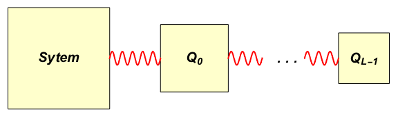

******************
Molecular Dynamics
******************

In this chapter performing molecular dynamics simulations using MAPP will be discussed.

Supported Ensembles
-------------------

.. autosummary::
   :toctree: generated/

   mapp4py.md.nvt
   mapp4py.md.nst
   mapp4py.md.muvt

.. _nhc-ref:

NHC Thermostat
--------------

The thermostat that is employed in MAPP is the well-known Nose-Hoover chains (NHC). Here we will touvh on the equations of motions of NHC breifly and its implementation in MAPP in order to clarify the meaning of some of the variables that users have control over, namely :math:`L`, :math:`t_{\mathrm{relax}}`, and :math:`n_{\mathrm{iters}}`. Interested reader might refer to :cite:`tuckerman_statistical_2010` and :cite:`frenkel_understanding_2002` for a full discription and mathematical formulation of of NHC governing equations. With that being said the main idea behind NHC is as follows: In order to simulate the coupling of a system with an external thermal bath, we couple its kinetic energy with kinetic enery of a series of fictitious object with fictitious masses, namely links in NHC chain. With index :math:`i` denoting :math:`i` th link in the chain.

Schematic representation of NHC of length :math:`L` .

Suppose we have a general :math:`d` dimeensional system with :math:`N_f` deggrees of freedom (they can be positions of atoms or anything else), namely :math:`y_0, \cdots, y_{N_f -1}`. The equations of motion are as follows:

.. math::

   \ddot{y}_i&=-\frac{1}{m_i}\frac{\partial U}{\partial y_i}-\dot{y}_i\dot{\xi}_0 \quad  0 \le i <N_f\\
   \ddot{\xi}_0&=\frac{N_f k_B}{Q_0} \left(T_{\mathrm{int}}-T_{\mathrm{ext}}\right)-\dot{\xi}_0\dot{\xi}_1\\
   \ddot{\xi}_i&=\frac{Q_{i-1}}{Q_i}\dot{\xi}_{i-1}^2-\frac{k_BT_{\mathrm{ext}}}{Q_i}-\dot{\xi}_i\dot{\xi}_{i+1} \quad 0 < i < L-1\\
   \ddot{\xi}_{L-1}&=\frac{Q_{L-2}}{Q_{L-1}}\dot{\xi}_{L-2}^2-\frac{k_BT_{\mathrm{ext}}}{Q_{L-1}}

where :math:`U` is the potential energy, and :math:`m_i` is the mass associated :math:`i` th degree of freedom; :math:`\xi_i` and :math:`Q_i` are degree of freedom of and mass of :math:`i` th link in Nose-Hoover chain, respectively. Here :math:`\dot{\square}` denotes derivative with respect to time. :math:`T_{\mathrm{ext}}` is the external (bath) temperature; :math:`T_{\mathrm{int}}` is the internal (current) temperature of system, calculated using

.. math::

   T_{\mathrm{int}}=\frac{1}{k_B N_f}\sum_{i=0}^{N_f-1} m_i\dot{y}_i^2

As it is apparent from the equations above :math:`\xi_i` is uinitless and :math:`Q_i` is of unit of :math:`\mathrm{ML^2}`. Let us intorduce the following change of variable

.. math::
   \theta_i&=\frac{Q_i}{Q_{i+1}}  \quad 0 < i < L-1\\
   t_{\mathrm{relax}}^2 &= \frac{Q_0}{N_f k_B T_{\mathrm{ext}}}

where :math:`\theta_i` is a unitless parameter and :math:`t_{\mathrm{relax}}` is a positive time scale, which in turn simplify thermostat equations of motion:

.. math::

   \ddot{\xi}_0&=t_{\mathrm{relax}}^{-2} \left(\frac{T_{\mathrm{int}}}{T_{\mathrm{ext}}}-1\right)-\dot{\xi}_0\dot{\xi}_1\\
   \ddot{\xi}_i&=\theta_{i-1}\dot{\xi}_{i-1}^2-\frac{t_{\mathrm{relax}}^{-2}}{N_f}\prod_{j=0}^{i-1}\theta_j-\dot{\xi}_i\dot{\xi}_{i+1} \quad 0 < i < L-1\\
   \ddot{\xi}_{L-1}&=\theta_{L-2}\dot{\xi}_{L-2}^2-\frac{t_{\mathrm{relax}}^{-2}}{N_f}\prod_{j=0}^{L-2}\theta_j

in MAPP as a matter of convention :math:`\theta_i` are chosen as follows:

.. math::

   \theta_0=N_f, \quad \theta_i=1,\quad 0 < i < L,

which gives us the final form of equations of motion implemented in MAPP:

.. math::

   \ddot{\xi}_0&=t_{\mathrm{relax}}^{-2} \frac{T_{\mathrm{int}}}{T_{\mathrm{ext}}}-t_{\mathrm{relax}}^{-2}-\dot{\xi}_0\dot{\xi}_1\\
   \ddot{\xi}_1&=N_f\dot{\xi}_{0}^2-t_{\mathrm{relax}}^{-2}-\dot{\xi}_1\dot{\xi}_{2} \\
   \ddot{\xi}_i&=\dot{\xi}_{i-1}^2-t_{\mathrm{relax}}^{-2}-\dot{\xi}_i\dot{\xi}_{i+1} \quad 1 < i < L-1\\
   \ddot{\xi}_{L-1}&=\dot{\xi}_{L-2}^2-t_{\mathrm{relax}}^{-2}

For completeness here are the equations of motions for :math:`L=2`:

.. math::

   \ddot{\xi}_0&=t_{\mathrm{relax}}^{-2} \frac{T_{\mathrm{int}}}{T_{\mathrm{ext}}}-t_{\mathrm{relax}}^{-2}-\dot{\xi}_0\dot{\xi}_1\\
   \ddot{\xi}_1&=N_f\dot{\xi}_{0}^2-t_{\mathrm{relax}}^{-2}

and :math:`L=1`:

.. math::

   \ddot{\xi}_0&=t_{\mathrm{relax}}^{-2} \frac{T_{\mathrm{int}}}{T_{\mathrm{ext}}}-t_{\mathrm{relax}}^{-2}

The two parameters :math:`t_{\mathrm{relax}}` and :math:`L` can be adjusted by user through the following attributes

* :math:`L` :

   :py:data:`mapp4py.md.nvt.L`

   :py:data:`mapp4py.md.muvt.L`

   :py:data:`mapp4py.md.nst.L`

   :py:data:`mapp4py.md.nst.L_s`

* :math:`t_{\mathrm{relax}}` :

   :py:data:`mapp4py.md.nvt.t_relax`

   :py:data:`mapp4py.md.muvt.t_relax`

   :py:data:`mapp4py.md.nst.t_relax`

   :py:data:`mapp4py.md.nst.t_relax_s`

Another variable that can be adjusted is :math:`n_{\mathrm{iters}}`, which is related to the numerical time integration. In order to increase the percision of numerical integration instead of eveolving the system through one step of :math:`\Delta t`, it can be performed through :math:`n_{\mathrm{iters}}` steps of :math:`\Delta t / n_{\mathrm{iters}}`. :math:`n_{\mathrm{iters}}` can be adjusted by user through the following attributes

* :math:`n_{\mathrm{iters}}` :

   :py:data:`mapp4py.md.nvt.niters`

   :py:data:`mapp4py.md.muvt.niters`

   :py:data:`mapp4py.md.nst.niters`

   :py:data:`mapp4py.md.nst.niters_s`

.. _nst-ref:

Isothermal-Isostress
--------------------

Isothermal-isostress ensemble that is used in mapp4py is taken from :cite:`shinoda_rapid_2004`. Aside from external stress, temperature and thermostat related parameters (see :ref:`nhc-ref`), there is one other matrix parameter (:math:`\mathbf{\tau}` ) that user has control over. Before going over the equations of motion it should be noted that our formultion is different from orginal presentation in three major ways:

   * stress is coupled to a separate thermostat rather than particle thermostat
   * unitcell matrix (:math:`\mathbf{H}` ) is the transpose of the one suggested in the original formulation (:math:`\mathbf{h}` )
   * unlike the original formulation unitcell mass is not scalar i.e. each of :math:`\mathbf{H}` components have their own mass, and are defined using a time scale matrix :math:`\mathbf{\tau}`

Cosider a :math:`d` dimensional unitcell defined by :math:`\mathbf{H}` tensor, containing :math:`N` atoms, interacting via a given potential energy, where :math:`\mathbf{x}_i` denotes the position of atom :math:`i`. The particles in the system have :math:`N_f` degrees of freedom (which is not necessarily equal to :math:`dN` ) and are coupled with NHC thermostat. The system is subjected to an external temperature of :math:`T_{\mathrm{ext}}` and an extrenal stress tensor :math:`\mathbf{S}_{\mathrm{ext}}`. The equations of motions regarding the particles are as follows

.. math::

   \dot{\mathbf{x}}_i&=\mathbf{x}_i\mathbf{V}^H+\mathbf{v}_i\\
   \dot{\mathbf{v}}_i&=-\mathbf{v}_i\biggl[\mathbf{V}^H+\left(\frac{\mathrm{Tr}[\mathbf{V}^H]}{N_f}+\dot{\xi}_0\right)\mathbf{I}\biggr]+\frac{\mathbf{f}_i}{m_i}

here :math:`\dot{\square}`  represents derivative with respect to time. Please note that here :math:`\mathbf{v}_i` is not the actual particle trajectory but rather :math:`\dot{\mathbf{x}}_i` is. :math:`\mathbf{f}_i` is the force exerted on atom :math:`i` due to potential energy and :math:`m_i` is its mass. :math:`\mathbf{V}^H` is a tensor representing the equivalent of velocity for :math:`\mathbf{H}`; :math:`\xi_0` is the particle thermostat related parameter, see :ref:`nhc-ref`. The equations of motion pertaining to :math:`\mathbf{H}` are:

.. math::

   \dot{\mathbf{V}}^H_{ij}&=\frac{ \mathbf{A}_{ij}}{k_B T_{\mathrm{ext}} \mathbf{\tau}_{ij}^2}  -\dot{\xi}_0^H\mathbf{V}^H_{ij}, \quad 0 \le i ,j  <d\\
   \dot{\mathbf{H}}&=\mathbf{H}\mathbf{V}_H

where :math:`\mathbf{\tau}` is a given length scale matrix; :math:`\xi_0^H` is the stress thermostat related parameter (see :ref:`nhc-ref`), and

.. math::

   \mathbf{A}&=v\left(s_{\mathrm{ext}}\mathbf{I}-\mathbf{S}_{\mathrm{int}}\right)+v_{\mathrm{ref}}\mathbf{H^T}\mathbf{H_{\mathrm{ref}}^{-T}}\mathbf{S}_{\mathrm{ext}}^{\mathrm{dev}}\mathbf{H_{\mathrm{ref}}^{-1}}\mathbf{H}+k_B T_{\mathrm{int}}\mathbf{I}

where :math:`v` is the current volume (determinant of :math:`\mathbf{H}`); :math:`\mathbf{H}_{\mathrm{ref}}` and :math:`v_{\mathrm{ref}}` describe the reference configuration and  is its volume, respectively; and

.. math::

   s_{\mathrm{ext}}=\frac{\mathrm{Tr}[\mathbf{S}_{\mathrm{ext}}]}{d}, \quad \mathbf{S}_{\mathrm{ext}}^{\mathrm{dev}}=\mathbf{S}_{\mathrm{ext}}-s_{\mathrm{ext}}\mathbf{I}

* :math:`\tau` :

   :py:data:`mapp4py.md.nst.tau`

References
----------
.. bibliography:: refs.bib
   :filter: docname in docnames
   :style: unsrt

